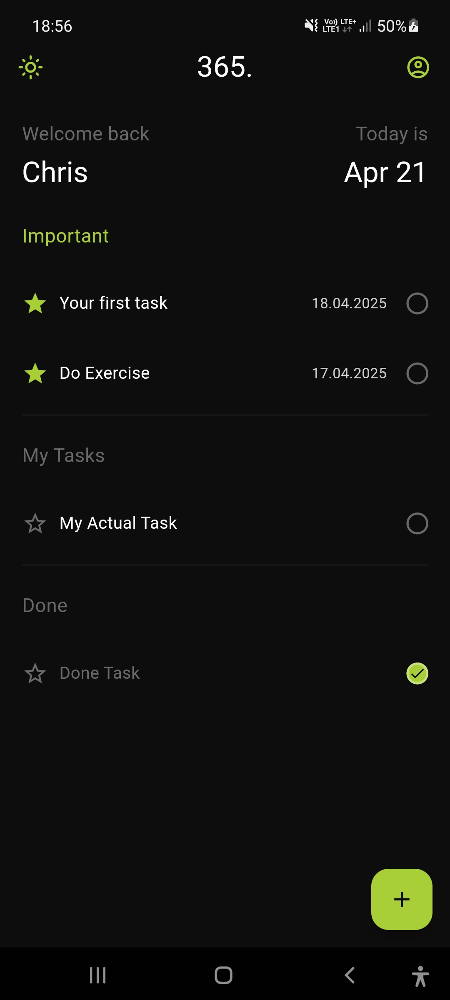

# ✅ ToDo App

A minimal and clean ToDo mobile app built with Flutter. It allows you to manage tasks, organize them into lists, mark priorities, and track due dates – all with support for light and dark themes.

## ✨ Features

- ✅ Create, edit, and delete tasks
- ⭐ Mark tasks as important
- 📅 Set task deadlines
- 🗂 Assign tasks to custom lists
- 🌗 Light & dark mode support
- 🔁 Repeating habits (coming soon)

## 📸 Screen



## 🚀 Getting Started

```bash
git clone https://github.com/your-username/todo-app.git
cd todo-app
flutter pub get
flutter run
